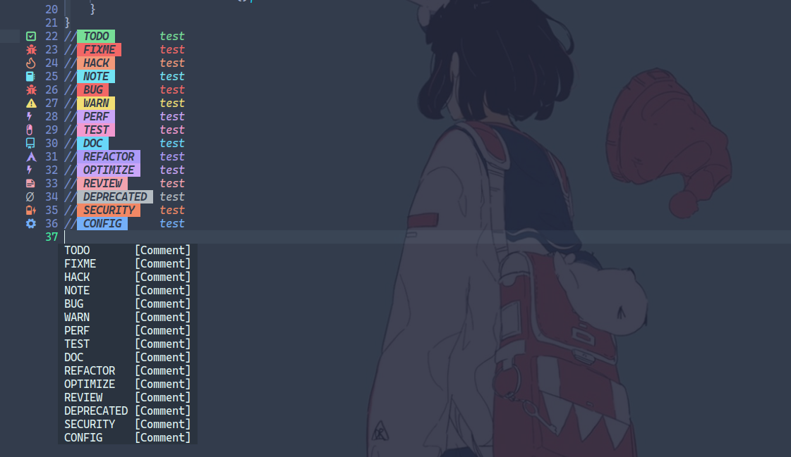

# neovim-config
<p align="center">


</p>
<p>my personal setup from neovim with transparent background
</p>
<br>

files structure:
```
├── init.lua                --INFO: neovim main file 
├── lazy-lock.json
└── lua
    ├── colorscheme.lua     --INFO: file containing active colorscheme settings
    ├── keybindings.lua     --INFO: keyboard shortcuts
    └── plugins             --INFO: plugins folder {each plugin separated by file}
```

> ❗ **ATTENTION**:<br>
>**⚠️ need to enable transparency in terminal settings to work properly**

>**⚠️ prettier.lua needs black formmater installed and added to the path**

>**⚠️ install nodejs and yarn before using the commands below**

>**⚠️ on windows you need to install neovim and the c/c++ compilation tools and add them to the path variable**


# Usage:
on linux :
```bash
git clone --depth 1 https://github.com/miauware/neovim-dotfiles.git ~/.config/nvim && nvim
```
on windows :

```bash
git clone --depth 1 https://github.com/miauware/neovim-dotfiles.git %LOCALAPPDATA%/nvim && nvim
```

# Keyboard shortcuts :

### Tab Navigation:
- `Ctrl+Right`: next tab
- `Ctrl+Left`: previous tab
- `Ctrl+left click in a file `: open in a new tab

### Terminal:
- `Ctrl+t`: open terminal inside Neovim

### Telescope (search):
- `<leader>?`: find recently opened files
- `<leader><space>`: list open buffers
- `<leader>/`: fuzzy search in current buffer
- `<leader>gf`: search Git files
- `<leader>sf`: search files in the system
- `<leader>sh`: search help tags
- `<leader>sw`: search current word
- `<leader>sg`: live grep
- `<leader>sd`: search diagnostics
- `[d`: go to previous diagnostic
- `]d`: go to next diagnostic
- `<leader>e`: show floating diagnostic
- `<leader>q`: open diagnostics list

### Editing:
- `Ctrl+s`: save
- `Ctrl+z`: undo
- `Ctrl+r`: redo
- `Ctrl+c`: copy
- `Ctrl+v`: paste
- `Ctrl+x`: cut
- `Ctrl+d`: duplicate current line above (insert mode)
- `Shift+← / Shift+→`: select text in insert mode
- `Tab`: insert 3 spaces (insert mode)

### Exit:
- `Ctrl+q`: quit current buffer

### Miscellaneous:
- `Right-click`: open custom popup menu

### Commands:
- Sessions managament with SessionStart SessionStop SessionSave SessionDelete and SessionLoad
- enable/disable transparency with TransparentToggle command


- `ctrl+]` in insert mode open comment menu with categories to add


